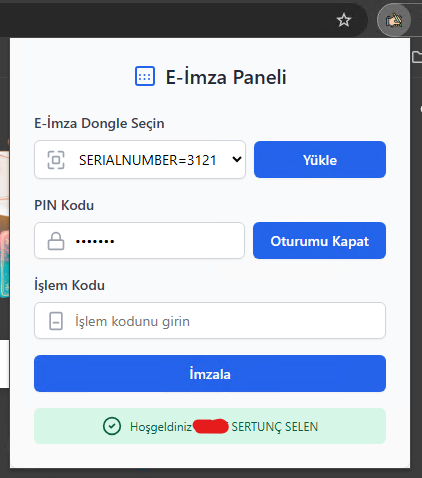

  

<h1 align="center">E-Signer Extension</h1>

  <b>Chrome için Güvenli Elektronik İmza Uzantısı</b> 
  <i>Secure E-Signature Extension for Chrome</i>

---

## 🚀 Özellikler | Features

- 🖥️ E-İmza dongle cihazlarını listeleme ve seçme  
  <i>List and select e-signature dongle devices</i>
- 🔐 PIN kodu ile oturum açma ve kapama  
  <i>Login and logout with PIN code</i>
- 📝 İşlem kodu ile imzalama işlemi  
  <i>Sign transactions with a transaction code</i>
- 🔔 Başarılı ve hatalı işlemler için kullanıcıya bildirim  
  <i>User notifications for successful and failed operations</i>
- ✨ Modern ve kullanıcı dostu arayüz  
  <i>Modern and user-friendly interface</i>

---

## 🛠️ Kurulum | Installation

1. Bu projeyi bilgisayarınıza indirin veya klonlayın.  
   <i>Download or clone this project to your computer.</i>
2. Chrome tarayıcısında `chrome://extensions/` adresine gidin.  
   <i>Go to `chrome://extensions/` in the Chrome browser.</i>
3. Sağ üstten "Geliştirici Modu"nu aktif edin.  
   <i>Enable "Developer Mode" in the top right corner.</i>
4. "Paketlenmemiş uzantı yükle" butonuna tıklayın ve proje klasörünü seçin.  
   <i>Click "Load unpacked" and select the project folder.</i>

---

## 📖 Kullanım | Usage

1. Uzantıyı Chrome araç çubuğundan açın.  
   <i>Open the extension from the Chrome toolbar.</i>
2. "Yükle" butonuna tıklayarak e-imza dongle cihazlarını listeleyin.  
   <i>Click the "Load" button to list e-signature dongle devices.</i>
3. Cihazınızı seçin ve PIN kodunuzu girerek oturum açın.  
   <i>Select your device and log in by entering your PIN code.</i>
4. İşlem kodunu girin ve "İmzala" butonuna tıklayın.  
   <i>Enter the transaction code and click the "Sign" button.</i>
5. Sonuç mesajını ekranda görebilirsiniz.  
   <i>You can see the result message on the screen.</i>

---

## 📦 Gereksinimler | Requirements

- Chrome tarayıcısı  
  <i>Chrome browser</i>
- E-İmza dongle cihazı  
  <i>E-signature dongle device</i>
- Arka planda çalışan ve uzantının iletişim kurduğu bir API  
  <i>A backend API that the extension communicates with</i>  
  (örn: http://localhost:2616/api/sign)
- API için iletişime geçebilirsiniz  
  <i>You can contact for API details</i>  
  (sertuncselen@yahoo.com)

---

## 📝 Geliştirici Notları | Developer Notes

- Arayüz dosyaları | UI files: `popup.html`, `assets/style.css`
- İş mantığı | Business logic: [`popup.js`](popup.js)
- Arka plan işlemleri | Background operations: [`background.js`](background.js)
- Uzantı yapılandırması | Extension configuration: [`manifest.json`](manifest.json)

---

## 📄 Lisans | License

Bu proje MIT lisansı ile lisanslanmıştır.  
<i>This project is licensed under the MIT License.</i>

---

  

